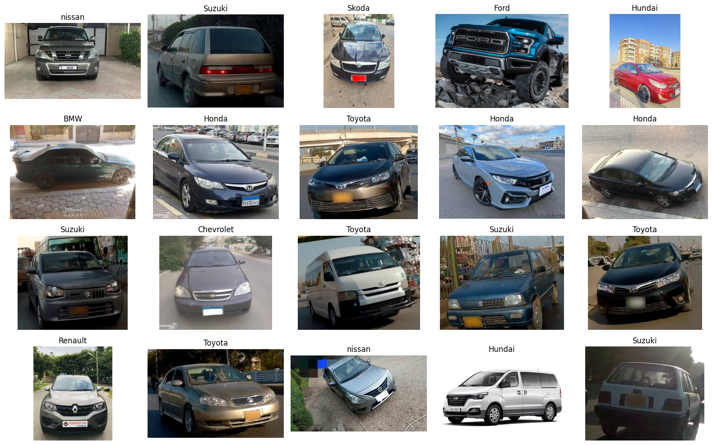
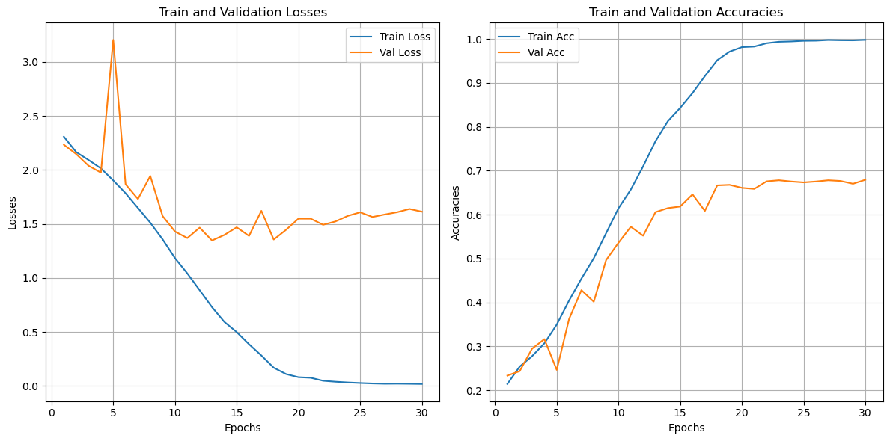
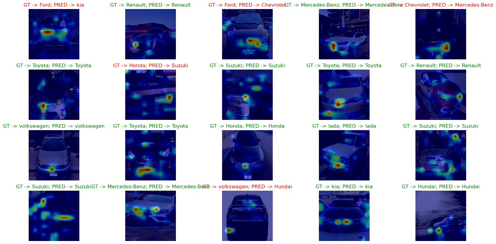
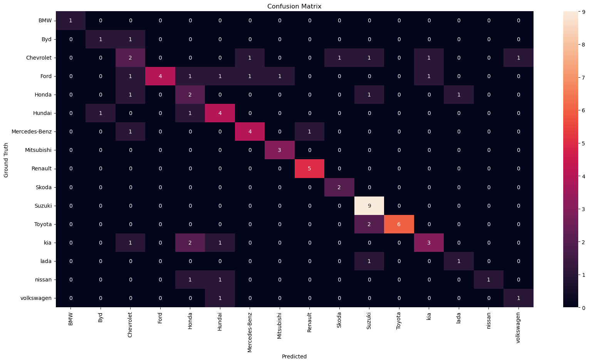

# 🚗 Car Brands Classification using Custom CNN

This project focuses on classifying car images into different brands using a custom Convolutional Neural Network (CNN) model built from scratch. The goal is to achieve high accuracy in identifying car brands based on visual features.

You can also deploy this model using streamlit and convert your saved model to onnx file using corresponding files.

---

## 📊 Project Overview

- **Task**: Multi-class image classification
- **Dataset**: Images of cars belonging to various brands (e.g., BMW, Audi, Mercedes, Toyota, etc.)
- **Model**: Custom CNN architecture (without using pre-trained models)
- **Framework**: PyTorch
- **Evaluation Metrics**: Accuracy, Loss, Confusion Matrix, Grad-CAM Visualizations

---

## 🗂️ Dataset Samples

Below are some random samples from the dataset with corresponding labels:



---

## 🏗️ CNN Model Architecture

The custom CNN model consists of several convolutional and pooling layers, followed by fully connected layers for classification. ReLU activations and batch normalization are used to improve performance.

---

## 📈 Training & Validation Curves

Here are the learning curves showing **Accuracy** and **Loss** over epochs:

### Train and Validation Curves


---

## 🧠 Grad-CAM Visualization

Grad-CAM is used to highlight the important regions in the image that contributed to the classification decision.



---

## 🧮 Confusion Matrix

The confusion matrix below illustrates the model's performance across different car brand classes.



---


## 🚀 How to Run

1. Clone the repository:
   
   ```
   git clone https://github.com/akhra92/Car-Brand-Classification.git
   cd Car-Brand-Classification
   ```

3. Install dependencies:

   ```
   pip install -r requirements.txt
   ```
   
4. Train and test the model:

   ```
   python main.py
   ```

5. Deploy in local using streamlit:
   
   ```
   streamlit run demo.py
   ```

6. Convert to onnx file:
   
   ```
   python convert_onnx.py
   ```


